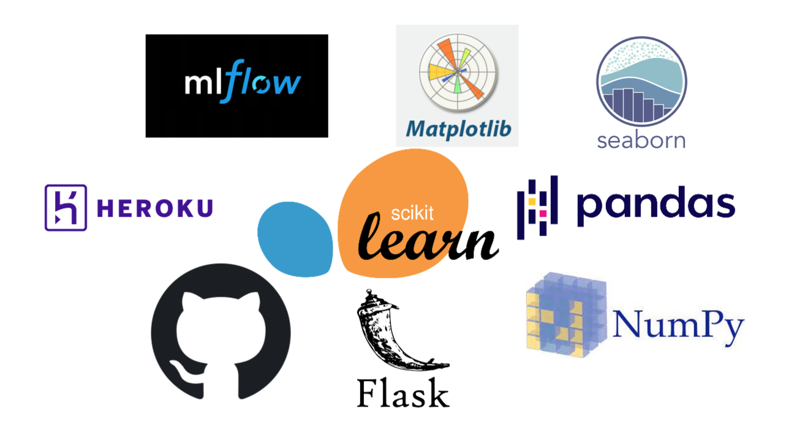
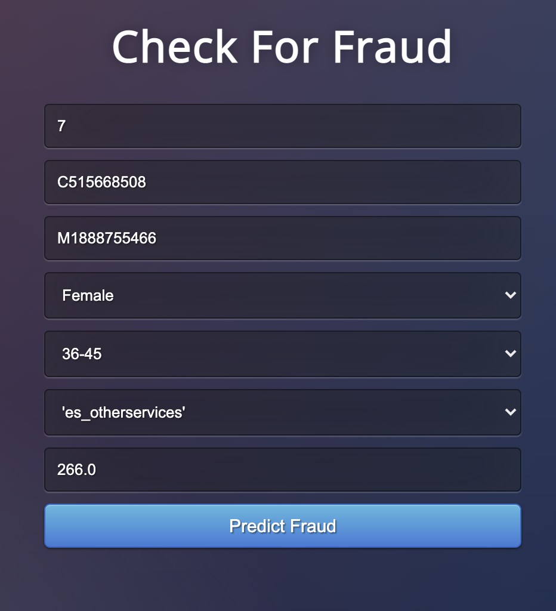

# 💰💰 Fraud Detection


## 💡 Problem Statement
Fraud detection is a set of activities undertaken to prevent money or property from being obtained through false pretenses. Fraud detection is applied to many industries such as banking or insurance.

## 🔭 Scope of the project
Over the past several years, we have seen an increase in digitization. More and more transactions are being made through the internet. With this, we have also seen an increase in the fraudulent activities happening in various domains. These are detrimental to the ecosystem of online transactions. Therefore, it is vital that a system be developed such that such fradulent transactions can be predicted, monitored and necessary actions be taken. 

## 📔 Data Description
The data and its overview is available [here](https://www.kaggle.com/ealaxi/banksim1).

A little more about the features present in the data is given in the **about.txt** file of this repository.

It is important to note that the data is **Synthetic**(fake) as it was generated using a simulator. Therefore, it may not be very useful in making inferences about similar real world scenarios.   

## ⽊ Project Tree Structure
```
├── images
|   ├── fraud_detection.png
|   ├── interface.png
|   └── tools.png
|
├── logs
│   ├── dataAnalysis.log
|   ├── dataProcessing.log
|   ├── featureEngineering.log
|   └── modelCreation.log
|
├── reports
│   ├── analyticsReport.txt
│   ├── dataProcessing.txt
│   └── featureEngineering.txt
│   
├── serialized_files
│   └── joblib
│        └── label_encoder_dict.joblib
│   └── pickle
│       └── naive_bayes.pkl
│       └── random_forest.pkl
├── src
│   ├── mlruns
│   ├── Notebook
|   |   └──dataAnalysis.ipynb
│   ├── dataPreprocessing.py
│   ├── featureEngineering.py
│   └── modelCreation.py
|
|── static/css
|   └──style.css
|
├── templates
│   └── index.html
|
|── about.txt
├── Procfile
├── app.py
├── requirements.txt
└── README.md
```
## 🛠 Tools used


1. **Visual Studio Code** is used as an IDE.
2. For visualization of the plots, **matplotlib** and **seaborn** are used.
3. For model training **scikit-learn** is used.
4. For model tracking **mlflow** is used.
5. Front end development is done using **HTML/CSS**.
6. **Flask** framework is used for backend development.
7. **GitHub** is used as a version control system.
8. **Heroku** Cloud Platform is used for deployment of the model.


## 👨🏻‍💻 Interface


In the application, evey field must be given an appropriate input. For instance, the **MERCHANT** and **CUSTOMER** input must be from the original dataset(They are categorical). New data will throw an error for it will not have the appropriate encoding. 

The web app link is given [here](https://bank-sim-api.herokuapp.com/).

## Contributors
Roman Regmi
